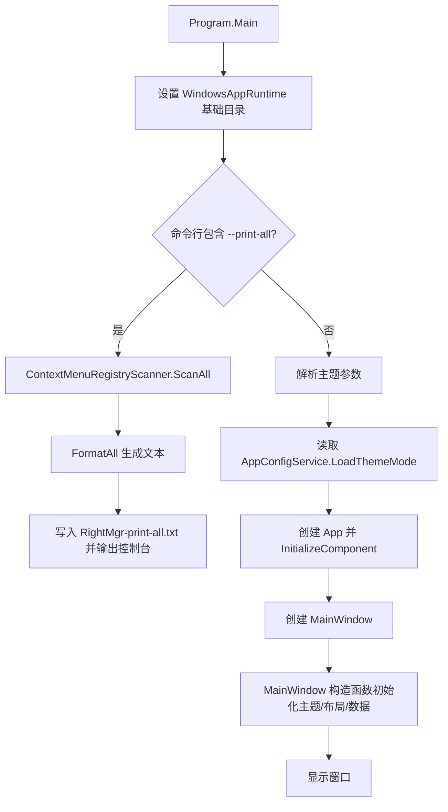
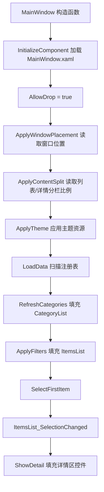
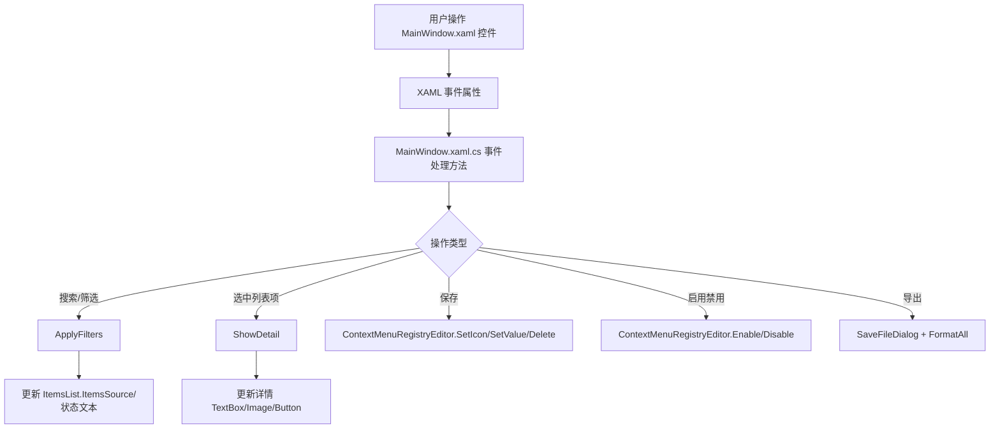
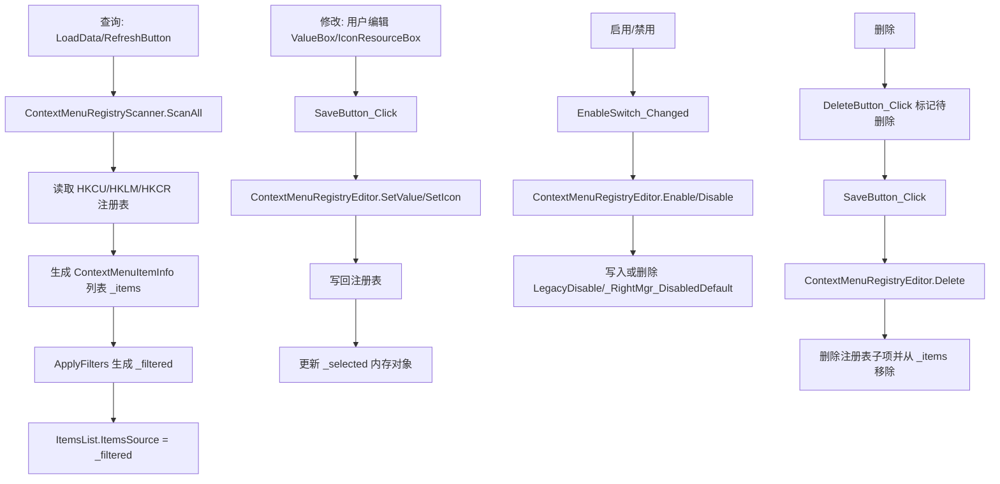
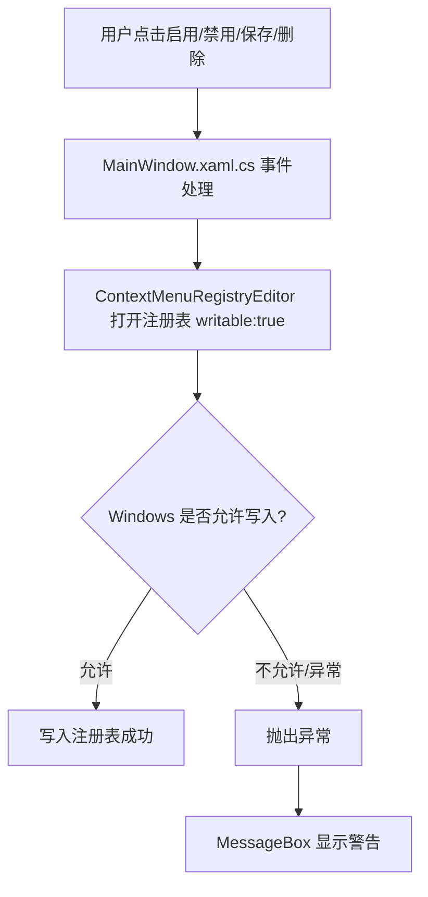

# RightMgr 项目解析

本文档基于当前源码目录 `D:\Documents\VSProjects\RightMgr` 分析，适合刚接手维护 RightMgr 的开发者阅读。

## 1. 项目整体说明

RightMgr 是一个 Windows 桌面工具，用来扫描、查看、筛选、启用/禁用、编辑和删除 Windows 资源管理器右键菜单注册表项。它关注两类右键菜单来源：

- 传统 `shell` 命令，也就是注册表中带 `command` 的右键菜单命令。
- `shellex\ContextMenuHandlers` COM 扩展，也就是通过 CLSID 注册的 Shell 扩展。

项目中未发现数据库、ViewModel、Controller、Repository、用户账号、权限认证或菜单权限模块。数据来源和保存目标都是 Windows 注册表；窗口主题、窗口位置、左右分栏比例保存到 `%APPDATA%\RightMgr\RightMgr.ini`。

### 技术栈

| 类型 | 内容 | 源码依据 |
| --- | --- | --- |
| 运行平台 | Windows 桌面 | `RightMgr.csproj` 使用 `net8.0-windows10.0.19041.0` |
| UI 框架 | WPF | `RightMgr.csproj` 中 `<UseWPF>true</UseWPF>` |
| 语言 | C# / XAML | `.cs`、`.xaml` 文件 |
| 运行时 | .NET 8 | `RightMgr.csproj` |
| Windows SDK | Microsoft.WindowsAppSDK 1.6.250205002 | `RightMgr.csproj` |
| 注册表访问 | `Microsoft.Win32.Registry` | `ContextMenuRegistryScanner.cs`、`ContextMenuRegistryEditor.cs` |
| Win32 调用 | DWM、Shell32、Shlwapi、User32 | `MainWindow.xaml.cs`、`ShellIconService.cs`、`NativeIconDialog.cs`、`ShellResourceResolver.cs` |
| 本地化 | 自定义 CSV + MarkupExtension | `Resources/i18n.csv`、`LocalizationService.cs` |

### 项目目录结构

```text
RightMgr
├─ App.xaml
├─ App.xaml.cs
├─ Program.cs
├─ RightMgr.csproj
├─ RightMgr.slnx
├─ app.manifest
├─ Package.appxmanifest
├─ Assets/
├─ Resources/
│  └─ i18n.csv
└─ src/
   ├─ Models/
   │  └─ ContextMenuItemInfo.cs
   ├─ Services/
   │  ├─ AppConfigService.cs
   │  ├─ AppThemeMode.cs
   │  ├─ AppThemePalette.cs
   │  ├─ ContextMenuRegistryEditor.cs
   │  ├─ ContextMenuRegistryScanner.cs
   │  ├─ LocalizationService.cs
   │  ├─ NativeIconDialog.cs
   │  ├─ ShellIconService.cs
   │  └─ ShellResourceResolver.cs
   └─ Views/
      ├─ MainWindow.xaml
      └─ MainWindow.xaml.cs
```

### 核心目录/文件作用

| 路径 | 作用 |
| --- | --- |
| `Program.cs` | 程序入口。解析命令行主题参数和 `--print-all`，创建 `App`，启动 `MainWindow`。 |
| `App.xaml` | WPF 应用资源，定义全局 `TextBox`、`Button` 默认样式。 |
| `App.xaml.cs` | `Application` 派生类，无额外逻辑。 |
| `RightMgr.csproj` | 项目配置、目标框架、WPF 开关、包引用、应用图标和资源配置。 |
| `src/Views/MainWindow.xaml` | 唯一主界面 XAML，包含侧栏、搜索、分类、列表、详情、按钮、状态栏。 |
| `src/Views/MainWindow.xaml.cs` | 主窗口后台代码，包含初始化、筛选、显示详情、启用禁用、保存、删除、导出、主题、窗口行为。 |
| `src/Models/ContextMenuItemInfo.cs` | 右键菜单条目的数据模型，实现 `INotifyPropertyChanged`，供列表模板绑定。 |
| `src/Services/ContextMenuRegistryScanner.cs` | 扫描注册表中的右键菜单项，并转换为 `ContextMenuItemInfo`。 |
| `src/Services/ContextMenuRegistryEditor.cs` | 修改注册表，实现启用、禁用、删除、设置图标、设置值。 |
| `src/Services/AppConfigService.cs` | 读取/写入 `%APPDATA%\RightMgr\RightMgr.ini`，保存主题、窗口位置、分栏比例。 |
| `src/Services/LocalizationService.cs` | 读取 `Resources/i18n.csv`，提供 `{services:Loc key}` XAML 本地化扩展。 |
| `src/Services/ShellResourceResolver.cs` | 解析 CLSID、Indirect String、图标资源路径、命令中的可执行文件路径。 |
| `src/Services/ShellIconService.cs` | 调用 Shell API 提取图标，缓存为临时 PNG。 |
| `src/Services/NativeIconDialog.cs` | 调用 Shell32 `PickIconDlg` 原生图标选择窗口。 |
| `Resources/i18n.csv` | 中英文界面文本。 |
| `Assets/` | 应用图标、打包资源、截图等静态资源。 |

### 启动入口

启动入口是 `Program.Main(string[] args)`，因为 `RightMgr.csproj` 中配置了：

```xml
<StartupObject>RightMgr.Program</StartupObject>
```

主流程：

1. 设置 `MICROSOFT_WINDOWSAPPRUNTIME_BASE_DIRECTORY`。
2. 如果命令行包含 `--print-all`，调用 `PrintAll()` 扫描所有右键菜单并输出 `RightMgr-print-all.txt`，不启动窗口。
3. 解析 `--light`、`--dark`、`--system`、`--theme` 等主题参数。
4. 如果命令行没有主题参数，则从 `AppConfigService.LoadThemeMode()` 读取配置。
5. 创建 `App`，执行 `InitializeComponent()`。
6. `app.Run(new MainWindow(...))` 打开主窗口。

## 2. 项目架构流程图

### 项目启动流程图



### 页面/View 加载流程图



### View 与后台代码交互流程图



### 数据增删改查流程图



### 权限/菜单/用户相关流程图

项目中未发现用户登录、角色权限、菜单权限表、数据库权限或后台鉴权逻辑。这里的“权限”主要是操作系统层面的注册表写入权限：写 `HKLM` 或某些受保护项时，可能受 Windows 权限限制。



## 3. View 代码详细解释

### View 清单

| View 文件 | 类型 | 后台代码 | 说明 |
| --- | --- | --- | --- |
| `src/Views/MainWindow.xaml` | WPF Window | `src/Views/MainWindow.xaml.cs` | 项目唯一独立 XAML 界面。 |
| 动态导出范围窗口 | 运行时创建的 `Window` | `MainWindow.ShowExportScopeDialog()` | 没有独立 XAML 文件，在 C# 中用 `StackPanel`、`ComboBox`、`Button` 动态拼装。 |

项目中未发现其他 Form、Page、UserControl、Razor、WinForms 界面文件。

### `src/Views/MainWindow.xaml`

功能：主窗口，负责显示右键菜单扫描结果，并提供搜索、分类筛选、类型筛选、详情查看、启用/禁用、保存、删除、复制、导出、主题切换、打开注册表、打开 DLL/图标路径等操作。

对应后台代码：`src/Views/MainWindow.xaml.cs`。

关联方式：XAML 根节点写了：

```xml
<Window x:Class="RightMgr.Views.MainWindow" ...>
```

后台类是：

```csharp
namespace RightMgr.Views;
public partial class MainWindow : Window
```

WPF 编译时会把 XAML 和 `partial` 后台类合并。带 `x:Name` 的控件会生成字段，后台代码可直接访问，例如 `SearchBox.Text`、`ItemsList.ItemsSource`、`EnableSwitch.IsChecked`。

初始化逻辑在 `MainWindow` 构造函数：

```csharp
public MainWindow(AppThemeMode themeMode = AppThemeMode.System)
{
    _themeMode = themeMode;
    InitializeComponent();
    AllowDrop = true;
    ApplyWindowPlacement();
    ApplyContentSplit();
    ApplyTheme();
    LoadData();
    Loaded += (_, _) => ApplyTheme();
}
```

事件绑定主要写在 XAML 属性中，例如：

| 控件 | XAML 事件 | 后台方法 |
| --- | --- | --- |
| `SearchBox` | `TextChanged` | `SearchBox_TextChanged` |
| `CategoryList` | `SelectionChanged` | `CategoryList_SelectionChanged` |
| `ItemsList` | `SelectionChanged` | `ItemsList_SelectionChanged` |
| `EnableSwitch` | `Checked`/`Unchecked` | `EnableSwitch_Changed` |
| `SaveButton` | `Click` | `SaveButton_Click` |
| `DeleteButton` | `Click` | `DeleteButton_Click` |
| `FilterButton` | `Click` | `FilterButton_Click` |
| `CurrentListFilterButton` | `Click` | `CurrentListFilterButton_Click` |
| `RefreshButton` | `Click` | `RefreshButton_Click` |
| `ExportButton` | `Click` | `ExportButton_Click` |
| `OpenClsidButton` | `Click` | `OpenClsidRegistryButton_Click` |
| `OpenDllPathButton` | `Click` | `OpenDllPathButton_Click` |
| `OpenIconPathButton` | `Click` | `OpenIconPathButton_Click` |
| `ChooseIconButton` | `Click` | `ChooseIconButton_Click` |

数据绑定位置：

- `CategoryList.ItemTemplate` 中 `TextBlock Text="{Binding}"`，绑定的是 `CategoryItem.ToString()`。
- `ItemsList.ItemTemplate` 中绑定 `ContextMenuItemInfo` 的属性：
  - `Image.Source="{Binding IconImageSource}"`
  - `Text="{Binding CompactTitle}"`
  - `Text="{Binding CompactSubtitle}"`
  - `TextDecorations="{Binding PendingDeleteTextDecorations}"`
- 详情区没有使用 WPF Binding，而是在 `ShowDetail(ContextMenuItemInfo item)` 中手动给控件赋值。

主要控件说明：

| 控件名 | 类型 | 作用 |
| --- | --- | --- |
| `ThemeButton` / `ThemeButtonIcon` | `Button` / `TextBlock` | 切换系统/浅色/深色主题，并显示主题图标。 |
| `HeaderSummaryText` | `TextBox` | 显示扫描到的总数量。 |
| `SearchBox` | `TextBox` | 全局搜索框，影响分类和列表。 |
| `FilterButton` / `FilterPopup` | `Button` / `Popup` | 打开全局搜索选项。 |
| `UseRegexBox` | `CheckBox` | 全局搜索是否使用正则。 |
| `SearchNameBox` | `CheckBox` | 全局搜索是否搜索名称字段。 |
| `SearchCategoryBox` | `CheckBox` | 全局搜索是否搜索分类字段。 |
| `SearchRegistryBox` | `CheckBox` | 全局搜索是否搜索注册表路径和值名。 |
| `SearchValueBox` | `CheckBox` | 全局搜索是否搜索注册表值。 |
| `SearchComBox` | `CheckBox` | 全局搜索是否搜索 CLSID、COM、DLL、图标字段。 |
| `CategoryList` | `ListBox` | 左侧分类列表，数据来自 `RefreshCategories()`。 |
| `EnableSwitch` | `CheckBox` | 启用或禁用当前选中的右键菜单项。 |
| `SaveButton` | `Button` | 保存详情区的值或执行待删除操作。 |
| `DeleteButton` | `Button` | 切换当前项“待删除/取消删除”状态。 |
| `ListTitleText` | `TextBlock` | 当前分类标题。 |
| `CountText` | `TextBlock` | 当前筛选结果数量。 |
| `ListPaneColumn` / `DetailPaneColumn` | `ColumnDefinition` | 控制列表区和详情区宽度。 |
| `ShellVerbFilterBox` | `CheckBox` | 是否显示传统 `shell` 命令。 |
| `ShellExFilterBox` | `CheckBox` | 是否显示 `shellex` COM 扩展。 |
| `CurrentListSearchBox` | `TextBox` | 当前列表内部搜索框。 |
| `CurrentListFilterPopup` | `Popup` | 当前列表搜索选项。 |
| `ItemsList` | `ListBox` | 右键菜单条目列表，数据来自 `_filtered`。 |
| `HeaderIcon` | `Image` | 当前菜单项图标。 |
| `MenuNameText` | `TextBox` | 当前菜单显示名，只读样式但可选择复制。 |
| `DescriptionText` | `TextBox` | 当前菜单描述。 |
| `CategoryBox` | `TextBox` | 当前菜单分类。 |
| `ScopeBox` | `TextBox` | 注册表作用范围，如当前用户/所有用户/合并视图。 |
| `RegistryPathBox` | `TextBox` | 完整注册表路径。 |
| `KeyNameBox` | `TextBox` | 注册表子项名。 |
| `ValueNameBox` | `TextBox` | 值名说明。 |
| `ValueBox` | `TextBox` | 可编辑的命令或默认值，保存时写回注册表。 |
| `ClsidBox` | `TextBox` | ShellEx 项的 CLSID。 |
| `DllPathBox` | `TextBox` | COM 扩展 DLL 路径。 |
| `IconResourceBox` | `TextBox` | 可编辑的图标资源路径，保存时写回注册表。 |
| `StatusText` | `TextBox` | 底部状态栏文本。 |

### 动态导出范围窗口

文件路径：无独立 View 文件。

创建位置：`src/Views/MainWindow.xaml.cs` 的 `ShowExportScopeDialog()`。

功能：导出时弹出一个小窗口，让用户选择导出范围。

主要控件：

| 控件变量 | 类型 | 作用 |
| --- | --- | --- |
| `dialog` | `Window` | 临时导出范围窗口。 |
| `root` | `StackPanel` | 容器。 |
| `comboBox` | `ComboBox` | 绑定 `BuildExportScopes()` 返回的 `List<ExportScope>`。 |
| `cancelButton` | `Button` | 关闭窗口，不导出。 |
| `exportButton` | `Button` | 取出 `comboBox.SelectedItem` 并关闭窗口。 |

绑定方式：

```csharp
comboBox.ItemsSource = scopes;
comboBox.SelectedIndex = 0;
comboBox.DisplayMemberPath = nameof(ExportScope.Label);
```

这里 `ExportScope` 是 `MainWindow.xaml.cs` 内部 record，包含 `Label` 和 `Items`。

## 4. View 中属性/参数/变量解释

### 关键字段变量

| 变量 | 类型 | 所属文件 | 作用 | 默认值/赋值位置 | 影响 |
| --- | --- | --- | --- | --- | --- |
| `_items` | `List<ContextMenuItemInfo>` | `MainWindow.xaml.cs` | 全部扫描结果 | 字段初始化为空；`LoadData()` 中赋值为 `ScanAll()` 结果 | 分类、筛选、导出全部、删除后移除 |
| `_filtered` | `List<ContextMenuItemInfo>` | `MainWindow.xaml.cs` | 当前筛选后的列表 | `ApplyFilters()` 中赋值 | `ItemsList.ItemsSource`、数量、状态栏、导出当前 |
| `_selected` | `ContextMenuItemInfo?` | `MainWindow.xaml.cs` | 当前详情区对应的数据项 | `ShowDetail()` 中赋值；`ClearDetail()` 中清空 | 保存、删除、启用禁用、打开注册表路径 |
| `_themeMode` | `AppThemeMode` | `MainWindow.xaml.cs` | 当前主题模式 | 构造函数传入；`ThemeButton_Click()` 切换 | 影响资源颜色和 DWM 暗色标题栏 |
| `_palette` | `AppThemePalette` | `MainWindow.xaml.cs` | 当前调色板 | `ApplyTheme()` 中赋值 | 影响 `DynamicResource` 颜色 |
| `_loading` | `bool` | `MainWindow.xaml.cs` | 防止初始化/批量赋值时触发事件重入 | 默认 `true`；`LoadData()`、`ShowDetail()` 中切换 | 多数事件开头判断 `_loading` |
| `_refreshingCategories` | `bool` | `MainWindow.xaml.cs` | 防止刷新分类时触发分类选择事件 | `RefreshCategories()` 中切换 | 避免递归调用 `ApplyFilters()` |

### 关键控件属性说明

| 属性/事件 | 所属控件 | 类型 | 作用 | 默认值/赋值位置 | 是否绑定 | 修改影响 |
| --- | --- | --- | --- | --- | --- | --- |
| `x:Name` | 多数控件 | `string` | 生成后台可访问字段 | XAML 中声明 | 否 | 改名必须同步改后台代码引用 |
| `Title` | `Window` | `string` | 窗口标题 | `{services:Loc app_title}` | 使用本地化扩展 | 改 key 会影响窗口标题 |
| `Width/Height/MinWidth/MinHeight` | `Window` | `double` | 初始和最小窗口尺寸 | XAML；位置可被配置覆盖 | 否 | 影响窗口默认大小 |
| `WindowStyle=None` | `Window` | 枚举 | 使用自绘标题栏 | XAML | 否 | 改掉会影响自定义最小化/最大化/关闭按钮 |
| `AllowDrop` | `Window` | `bool` | 允许拖入文件按扩展名筛选 | 构造函数设为 `true` | 否 | 关闭后拖放筛选失效 |
| `DragOver/Drop` | `Window` | 事件 | 拖入文件处理 | XAML 绑定 | 否 | 对应 `Window_DragOver`、`Window_Drop` |
| `Text` | `SearchBox` | `string` | 全局搜索关键字 | 用户输入 | 否，事件读取 | 修改触发 `SearchBox_TextChanged` |
| `IsChecked` | `UseRegexBox` 等 | `bool?` | 搜索选项 | 多数默认 `True` | 否，事件读取 | 影响 `EnumerateSearchValues()` 和正则匹配 |
| `ItemsSource` | `CategoryList` | `IEnumerable` | 分类列表数据源 | `RefreshCategories()` | 手动赋值 | 影响左侧分类显示 |
| `SelectedItem` | `CategoryList` | `object` | 当前分类 | `RefreshCategories()` 或用户选择 | 否，事件读取 | 影响 `GetSelectedCategory()` |
| `ItemsSource` | `ItemsList` | `IEnumerable` | 当前右键菜单条目 | `ApplyFilters()` | 手动赋值 | 影响列表显示 |
| `SelectedItem` | `ItemsList` | `object` | 当前条目 | 用户选择或 `SelectedIndex=0` | 否，事件读取 | 触发 `ShowDetail()` |
| `Source` | `ItemsList` 模板 `Image` | `ImageSource` | 列表图标 | `{Binding IconImageSource}` | 是 | 来自 `ContextMenuItemInfo.IconImageSource` |
| `Text` | `ItemsList` 模板标题 | `string` | 条目标题 | `{Binding CompactTitle}` | 是 | 来自 `DisplayName` |
| `TextDecorations` | `ItemsList` 模板标题 | `TextDecorationCollection?` | 待删除时加删除线 | `{Binding PendingDeleteTextDecorations}` | 是 | `IsPendingDelete` 改变会通知刷新 |
| `IsChecked` | `EnableSwitch` | `bool?` | 当前项启用状态 | `ShowDetail()` 赋值 | 否，事件写注册表 | 改变会调用 Enable/Disable |
| `IsEnabled` | `EnableSwitch/SaveButton/DeleteButton` | `bool` | 是否允许操作 | `ShowDetail()` 设 `true`，`ClearDetail()` 设 `false` | 否 | 无选中项时防止操作 |
| `Text` | `ValueBox` | `string` | 命令或默认值 | `ShowDetail()` 赋值 | 否，保存时读取 | `SaveButton_Click` 写回注册表 |
| `Text` | `IconResourceBox` | `string` | 图标资源 | `ShowDetail()` 或 `ChooseIconButton_Click()` 赋值 | 否，保存时读取 | `SaveButton_Click` 写回注册表 |
| `Visibility` | `OpenClsidButton` | `Visibility` | 是否显示打开 CLSID 按钮 | `ShowDetail()` 根据 `item.Clsid` 设置 | 否 | CLSID 为空则隐藏 |
| `Visibility` | `OpenDllPathButton` | `Visibility` | 是否显示打开 DLL 按钮 | `ShowDetail()` 根据 `InProcServer32` 设置 | 否 | DLL 为空则隐藏 |
| `Visibility` | `OpenIconPathButton` | `Visibility` | 是否显示打开图标路径按钮 | `ShowDetail()` 根据可解析文件路径设置 | 否 | 图标资源无文件路径则隐藏 |
| `Width` | `ListPaneColumn` | `GridLength` | 列表栏宽度 | XAML 默认 `420`；`ApplyContentSplit()` 覆盖 | 否 | 拖动分隔条后保存比例 |
| `Width` | `DetailPaneColumn` | `GridLength` | 详情栏宽度 | XAML `*` | 否 | 和列表栏一起决定布局 |

### 数据模型字段与界面字段对应关系

| 模型字段/属性 | 界面位置 | 赋值/绑定方式 |
| --- | --- | --- |
| `DisplayName` | 列表标题、详情标题 | 列表绑定 `CompactTitle`；详情 `MenuNameText.Text = item.DisplayName` |
| `Description` | 详情描述 | `DescriptionText.Text = item.Description ?? item.ClsidName ?? item.MenuName` |
| `BigCategory` | 分类列表、详情分类 | `RefreshCategories()` 分组；`CategoryBox.Text` |
| `AppliesTo` | 列表副标题、详情分类 | `CompactSubtitle`、`CategoryBox.Text` |
| `MiddleCategory` | 列表副标题、详情分类 | `CompactSubtitle`、`CategoryBox.Text` |
| `Scope` | 详情范围 | `ScopeBox.Text` |
| `SourceRoot` | 详情范围、注册表写入定位 | `ScopeBox.Text`；`ContextMenuRegistryEditor.ResolveRootAndPath()` |
| `RegistryPath` | 列表副标题、详情注册表路径 | `CompactSubtitle`、`RegistryPathBox.Text` |
| `RelativeRegistryPath` | 后台定位注册表 | 不直接显示 |
| `KeyName` | 详情项名 | `KeyNameBox.Text` |
| `ValueName` | 详情值名 | `ValueNameBox.Text` |
| `Value` | 详情可编辑值 | `ValueBox.Text`，保存后 `SetValue()` |
| `Kind` | 类型筛选、分类、启用禁用逻辑 | `ApplyTypeAndSearchFilters()`、`ContextMenuRegistryEditor` |
| `IsEnabled` | 启用开关 | `EnableSwitch.IsChecked` |
| `Clsid` | CLSID 文本框和按钮显示 | `ClsidBox.Text`、`OpenClsidButton.Visibility` |
| `ClsidName` | 描述备选字段 | `DescriptionText.Text` |
| `LocalizedString` | 搜索和复制 | 不直接显示 |
| `IconResource` | 图标资源文本框 | `IconResourceBox.Text`，保存后 `SetIcon()` |
| `IconFilePath` | 详情图标 | `ShowIcon(item.IconFilePath)` |
| `IconImageSource` | 列表图标 | XAML 绑定 |
| `InProcServer32` | DLL 路径文本框 | `DllPathBox.Text` |
| `IsPendingDelete` | 删除线、保存删除 | `DeleteButton_Click()` 切换；列表绑定删除线 |

## 5. 变量绑定和数据流

### View 上显示的数据来自哪里

主数据来自 `ContextMenuRegistryScanner.ScanAll()`。它扫描 `HKCU`、`HKLM`、`HKCR` 下的 `Software\Classes`、`SOFTWARE\Classes`、`HKEY_CLASSES_ROOT` 相关路径，包括 `*\shell`、`Directory\shell`、`Folder\shellex\ContextMenuHandlers`、扩展名关联等。扫描结果转换为 `ContextMenuItemInfo`。

项目中未发现数据库。项目中未发现 ViewModel、Controller、Repository。这里采用 WPF CodeBehind 方式：`MainWindow.xaml.cs` 直接持有数据列表，直接操作控件，直接调用 Service。

### 用户修改界面数据后的去向

- 修改 `ValueBox.Text` 后点击保存：`SaveButton_Click()` 调用 `ContextMenuRegistryEditor.SetValue()` 写注册表。
- 修改 `IconResourceBox.Text` 或点击选择图标后点击保存：`SaveButton_Click()` 调用 `ContextMenuRegistryEditor.SetIcon()` 写注册表。
- 切换 `EnableSwitch`：`EnableSwitch_Changed()` 立即调用 `Enable()` 或 `Disable()` 写注册表。
- 点击删除：`DeleteButton_Click()` 只标记 `IsPendingDelete`；再次点击保存才调用 `Delete()` 删除注册表子项。
- 搜索/筛选只影响 `_filtered` 和界面列表，不写注册表。

### 数据流表

| View 文件 | 控件/字段 | 绑定变量 | 数据来源 | 修改后去向 | 相关方法 |
| --- | --- | --- | --- | --- | --- |
| `src/Views/MainWindow.xaml` | `CategoryList` | `CategoryItem` | `_items` 经 `RefreshCategories()` 分组 | 用户选择后重新筛选 | `RefreshCategories`、`CategoryList_SelectionChanged`、`ApplyFilters` |
| `src/Views/MainWindow.xaml` | `ItemsList` | `_filtered` / `ContextMenuItemInfo` | `_items` 经 `ApplyFilters()` | 选择后显示详情 | `ApplyFilters`、`ItemsList_SelectionChanged`、`ShowDetail` |
| `src/Views/MainWindow.xaml` | 列表图标 | `IconImageSource` | `ContextMenuItemInfo.IconFilePath` 加载 PNG | 不可直接修改 | `ShellIconService.GetPngIconPathForTarget` |
| `src/Views/MainWindow.xaml` | 列表标题 | `CompactTitle` | `DisplayName` | 不可直接修改 | `ContextMenuItemInfo.CompactTitle` |
| `src/Views/MainWindow.xaml` | 列表副标题 | `CompactSubtitle` | `AppliesTo/MiddleCategory/RegistryPath` | 不可直接修改 | `ContextMenuItemInfo.CompactSubtitle` |
| `src/Views/MainWindow.xaml` | `SearchBox` | 无 Binding，后台读 `Text` | 用户输入 | 仅影响筛选 | `SearchBox_TextChanged`、`Matches` |
| `src/Views/MainWindow.xaml` | `CurrentListSearchBox` | 无 Binding，后台读 `Text` | 用户输入 | 仅影响当前列表筛选 | `CurrentListSearchBox_TextChanged`、`MatchesCurrentListSearch` |
| `src/Views/MainWindow.xaml` | `ShellVerbFilterBox` | 无 Binding，后台读 `IsChecked` | XAML 默认 `True` | 仅影响筛选 | `TypeFilter_Changed`、`ApplyTypeAndSearchFilters` |
| `src/Views/MainWindow.xaml` | `ShellExFilterBox` | 无 Binding，后台读 `IsChecked` | XAML 默认 `True` | 仅影响筛选 | `TypeFilter_Changed`、`ApplyTypeAndSearchFilters` |
| `src/Views/MainWindow.xaml` | `MenuNameText` | `_selected.DisplayName` | `ShowDetail()` 手动赋值 | 不保存 | `ShowDetail` |
| `src/Views/MainWindow.xaml` | `DescriptionText` | `_selected.Description/ClsidName/MenuName` | `ShowDetail()` 手动赋值 | 不保存 | `ShowDetail` |
| `src/Views/MainWindow.xaml` | `CategoryBox` | `_selected.BigCategory/AppliesTo/MiddleCategory` | `ShowDetail()` 手动赋值 | 不保存 | `ShowDetail` |
| `src/Views/MainWindow.xaml` | `ScopeBox` | `_selected.Scope/SourceRoot` | `ShowDetail()` 手动赋值 | 不保存 | `ShowDetail` |
| `src/Views/MainWindow.xaml` | `RegistryPathBox` | `_selected.RegistryPath` | `ShowDetail()` 手动赋值 | 打开注册表使用 | `OpenRegistryButton_Click` |
| `src/Views/MainWindow.xaml` | `ValueBox` | `_selected.Value` | `ShowDetail()` 手动赋值 | 注册表默认值或 `command` 默认值 | `SaveButton_Click`、`ContextMenuRegistryEditor.SetValue` |
| `src/Views/MainWindow.xaml` | `IconResourceBox` | `_selected.IconResource` | `ShowDetail()` 手动赋值 | 注册表 `Icon` 或 CLSID `DefaultIcon` | `ChooseIconButton_Click`、`SaveButton_Click`、`SetIcon` |
| `src/Views/MainWindow.xaml` | `EnableSwitch` | `_selected.IsEnabled` | `ShowDetail()` 手动赋值 | 注册表禁用标记 | `EnableSwitch_Changed`、`Enable`、`Disable` |
| `src/Views/MainWindow.xaml` | `DeleteButton` | `_selected.IsPendingDelete` | 点击删除按钮切换 | 保存时删除注册表子项 | `DeleteButton_Click`、`SaveButton_Click`、`Delete` |
| 动态窗口 | `comboBox` | `ExportScope` | `BuildExportScopes()` | 选择导出范围 | `ShowExportScopeDialog`、`ExportButton_Click` |

## 6. View 和后台代码对应关系

| View | 后台类 | 关联方式 | 主要事件 | 调用方法 | 说明 |
| --- | --- | --- | --- | --- | --- |
| `src/Views/MainWindow.xaml` | `RightMgr.Views.MainWindow` | `x:Class` + `partial class` | `Loaded` | `ApplyTheme` | 窗口加载后重新应用主题。 |
| `src/Views/MainWindow.xaml` | `RightMgr.Views.MainWindow` | `x:Name` 控件字段 | `SearchBox_TextChanged` | `ApplyFilters`、`SelectFirstItem` | 全局搜索。 |
| `src/Views/MainWindow.xaml` | `RightMgr.Views.MainWindow` | `SelectionChanged` | `CategoryList_SelectionChanged` | `ApplyFilters`、`SelectFirstItem` | 分类切换。 |
| `src/Views/MainWindow.xaml` | `RightMgr.Views.MainWindow` | `SelectionChanged` | `ItemsList_SelectionChanged` | `ShowDetail` | 列表选中后显示详情。 |
| `src/Views/MainWindow.xaml` | `RightMgr.Views.MainWindow` | `Checked/Unchecked` | `TypeFilter_Changed` | `ApplyFilters`、`SelectFirstItem` | Shell/ShellEx 类型筛选。 |
| `src/Views/MainWindow.xaml` | `RightMgr.Views.MainWindow` | `Checked/Unchecked` | `SearchOptions_Changed` | `ApplyFilters`、`SelectFirstItem` | 全局搜索字段范围变化。 |
| `src/Views/MainWindow.xaml` | `RightMgr.Views.MainWindow` | `Checked/Unchecked` | `CurrentSearchOptions_Changed` | `ApplyFilters`、`SelectFirstItem` | 当前列表搜索字段范围变化。 |
| `src/Views/MainWindow.xaml` | `RightMgr.Views.MainWindow` | `Checked/Unchecked` | `EnableSwitch_Changed` | `ContextMenuRegistryEditor.Enable/Disable` | 直接写注册表启用/禁用。 |
| `src/Views/MainWindow.xaml` | `RightMgr.Views.MainWindow` | `Click` | `SaveButton_Click` | `SetIcon`、`SetValue`、`Delete` | 保存修改或执行待删除。 |
| `src/Views/MainWindow.xaml` | `RightMgr.Views.MainWindow` | `Click` | `DeleteButton_Click` | 无 Service 调用 | 只切换待删除状态，真正删除在保存按钮中。 |
| `src/Views/MainWindow.xaml` | `RightMgr.Views.MainWindow` | `Click` | `RefreshButton_Click` | `LoadData` | 重新扫描注册表。 |
| `src/Views/MainWindow.xaml` | `RightMgr.Views.MainWindow` | `Click` | `ExportButton_Click` | `ShowExportScopeDialog`、`FormatAll` | 导出文本文件。 |
| `src/Views/MainWindow.xaml` | `RightMgr.Views.MainWindow` | `Click` | `ThemeButton_Click` | `AppConfigService.SaveThemeMode`、`ApplyTheme` | 切换主题并保存配置。 |
| 动态导出窗口 | `Window` 局部变量 | C# 构造控件 | `cancelButton.Click`、`exportButton.Click` | `dialog.Close` | 没有 XAML 文件。 |

## 7. 增删改查 View 应该怎么操作

本项目不是数据库 CRUD 项目。如果按现有风格新增“页面”，更准确说是新增 WPF Window/UserControl 或在 `MainWindow.xaml` 中新增一个区域，然后在 CodeBehind 中直接写事件逻辑，调用 Service 操作注册表。

### 新增 View

1. 新建文件：
   - 如果是独立窗口，放到 `src/Views/`，例如 `MyFeatureWindow.xaml` 和 `MyFeatureWindow.xaml.cs`。
   - 如果只是主窗口中的功能区，可直接修改 `src/Views/MainWindow.xaml`。
2. 命名方式：
   - XAML 根节点写 `x:Class="RightMgr.Views.MyFeatureWindow"`。
   - 后台类写 `public partial class MyFeatureWindow : Window`。
3. 设计界面：
   - 参考 `MainWindow.xaml` 中的 `Button`、`TextBox`、`CheckBox` 样式资源。
   - 文本优先加入 `Resources/i18n.csv`，XAML 使用 `{services:Loc key}`。
4. 绑定数据：
   - 当前项目没有 ViewModel。列表数据通常通过 `ListBox.ItemsSource = list` 手动赋值。
   - 若要列表模板自动刷新，模型需要实现 `INotifyPropertyChanged`，参考 `ContextMenuItemInfo`。
5. 添加按钮事件：
   - XAML 写 `Click="MyButton_Click"`。
   - 后台实现 `private void MyButton_Click(object sender, RoutedEventArgs e)`。
6. 接入菜单/导航：
   - 项目未发现路由或导航框架。
   - 若加入主窗口侧栏，需要修改 `MainWindow.xaml` 的侧栏区域，并在 `MainWindow.xaml.cs` 中添加事件。
7. 调用业务逻辑：
   - 服务类放 `src/Services/`。
   - 如果操作注册表，参考 `ContextMenuRegistryScanner` 和 `ContextMenuRegistryEditor`。
8. 保存数据：
   - 注册表数据用 `Microsoft.Win32.Registry` 写入。
   - 应用配置用 `AppConfigService` 写入 INI。

### 修改 View

| 修改内容 | 需要改哪里 |
| --- | --- |
| 修改界面布局 | `src/Views/MainWindow.xaml` 的 `Grid`、`DockPanel`、`StackPanel`、`ColumnDefinition` 等 |
| 修改字段显示 | `MainWindow.xaml` 详情区控件 + `MainWindow.xaml.cs` 的 `ShowDetail()` |
| 修改列表显示 | `ItemsList.ItemTemplate` + `ContextMenuItemInfo` 计算属性 |
| 修改绑定变量 | `ContextMenuItemInfo` 属性名、XAML `{Binding ...}`、后台赋值逻辑 |
| 修改事件逻辑 | `MainWindow.xaml.cs` 对应事件处理方法 |
| 修改本地化文本 | `Resources/i18n.csv`，并确认 XAML 或 C# 中使用的 key |
| 修改注册表字段 | `ContextMenuRegistryScanner.AddItem()` 读取逻辑 + `ContextMenuRegistryEditor` 写入逻辑 + `ShowDetail()` 显示逻辑 |

### 删除 View

1. 删除对应 `.xaml` 和 `.xaml.cs` 文件。
2. 如果删除的是 `MainWindow`，还必须改 `Program.cs` 中 `app.Run(new MainWindow(...))`。
3. 删除 XAML 中按钮、列表、弹窗等入口。
4. 删除后台事件处理方法。
5. 删除无用 Service 方法。
6. 用 `rg "类名|控件名|事件名"` 检查是否还有引用。
7. 删除 `Resources/i18n.csv` 中不再使用的 key。

### 查询 View

当前查询模式是内存筛选：

1. `LoadData()` 调用 `ContextMenuRegistryScanner.ScanAll()` 得到全量 `_items`。
2. 查询条件控件写在 XAML，例如 `SearchBox`、`UseRegexBox`、`SearchNameBox`。
3. 查询按钮不是必须的；本项目用 `TextChanged` 和 `Checked/Unchecked` 实时查询。
4. 事件中调用 `ApplyFilters()`。
5. `ApplyFilters()` 根据类型、搜索条件、分类、当前列表搜索生成 `_filtered`。
6. `ItemsList.ItemsSource = _filtered` 刷新结果。

项目中未发现分页。排序在 `ContextMenuRegistryScanner.ScanAll()` 末尾完成：按 `BigCategory`、`AppliesTo`、`MiddleCategory`、`DisplayName` 排序。筛选支持普通包含匹配和正则匹配。

## 8. 典型页面代码举例：MainWindow

### View 代码片段：列表绑定

```xml
<ListBox x:Name="ItemsList" Grid.Row="1" SelectionChanged="ItemsList_SelectionChanged" ItemContainerStyle="{StaticResource EntryItemStyle}">
    <ListBox.ItemTemplate>
        <DataTemplate>
            <Border Padding="14,11" BorderBrush="{DynamicResource Line}" BorderThickness="0,0,0,1" Background="{DynamicResource Surface}">
                <DockPanel>
                    <Image DockPanel.Dock="Left" Width="22" Height="22" Source="{Binding IconImageSource}" Margin="0,2,11,0" />
                    <StackPanel>
                        <TextBlock Text="{Binding CompactTitle}" FontWeight="SemiBold" Foreground="{DynamicResource Ink}" TextTrimming="CharacterEllipsis" TextDecorations="{Binding PendingDeleteTextDecorations}" />
                        <TextBlock Text="{Binding CompactSubtitle}" FontSize="{StaticResource FontSizeLabel}" Foreground="{DynamicResource Muted}" TextTrimming="CharacterEllipsis" Margin="0,2,0,0" />
                    </StackPanel>
                </DockPanel>
            </Border>
        </DataTemplate>
    </ListBox.ItemTemplate>
</ListBox>
```

关键解释：

- `x:Name="ItemsList"`：让后台 `MainWindow.xaml.cs` 可以直接访问 `ItemsList`。
- `SelectionChanged="ItemsList_SelectionChanged"`：用户选择列表项时调用后台方法。
- `ItemsList.ItemsSource` 不在 XAML 中写死，而是在 `ApplyFilters()` 中赋值。
- `Source="{Binding IconImageSource}"`：每一行绑定当前 `ContextMenuItemInfo.IconImageSource`。
- `Text="{Binding CompactTitle}"`：显示 `DisplayName`。
- `TextDecorations="{Binding PendingDeleteTextDecorations}"`：如果 `IsPendingDelete=true`，显示删除线。
- `Text="{Binding CompactSubtitle}"`：显示作用对象、类别和注册表路径。

### 后台初始化代码

```csharp
public MainWindow(AppThemeMode themeMode = AppThemeMode.System)
{
    _themeMode = themeMode;
    InitializeComponent();
    AllowDrop = true;
    ApplyWindowPlacement();
    ApplyContentSplit();
    ApplyTheme();
    LoadData();
    Loaded += (_, _) => ApplyTheme();
}
```

关键解释：

- `_themeMode = themeMode`：保存当前主题模式。
- `InitializeComponent()`：加载 `MainWindow.xaml`，创建控件字段。
- `AllowDrop = true`：允许拖拽文件到窗口。
- `ApplyWindowPlacement()`：从 INI 恢复窗口位置和大小。
- `ApplyContentSplit()`：从 INI 恢复列表/详情分栏比例。
- `ApplyTheme()`：根据主题模式替换资源颜色。
- `LoadData()`：扫描注册表，填充列表。
- `Loaded += ...`：窗口加载后再次应用主题，确保窗口句柄初始化后 DWM 暗色设置生效。

### 查询逻辑

```csharp
private void LoadData()
{
    _loading = true;
    _items = ContextMenuRegistryScanner.ScanAll();

    HeaderSummaryText.Text = LocalizationService.Format("status_scanned", _items.Count);
    _loading = false;

    RefreshCategories("全部");
    ApplyFilters();
    SelectFirstItem();
    Dispatcher.BeginInvoke(ApplyTheme, System.Windows.Threading.DispatcherPriority.Loaded);
}
```

- `_loading = true`：避免初始化过程中触发搜索、分类等事件造成重复刷新。
- `_items = ContextMenuRegistryScanner.ScanAll()`：读取注册表并得到全量数据。
- `HeaderSummaryText.Text`：显示扫描数量。
- `_loading = false`：允许后续事件正常工作。
- `RefreshCategories("全部")`：按分类统计数量，选中“全部”。
- `ApplyFilters()`：根据当前搜索框、复选框、分类生成 `_filtered`。
- `SelectFirstItem()`：默认选中第一项并显示详情。

```csharp
private void ApplyFilters()
{
    if (_loading) return;

    var category = GetSelectedCategory();
    var includeShellVerb = ShellVerbFilterBox.IsChecked == true;
    var includeShellEx = ShellExFilterBox.IsChecked == true;
    var query = SearchBox.Text?.Trim() ?? "";

    IEnumerable<ContextMenuItemInfo> items = ApplyTypeAndSearchFilters(_items, includeShellVerb, includeShellEx, query);

    RefreshCategories(category);

    if (category != "全部")
        items = items.Where(x => x.BigCategory.Equals(category, StringComparison.OrdinalIgnoreCase));

    var currentListQuery = CurrentListSearchBox.Text?.Trim() ?? "";
    if (!string.IsNullOrWhiteSpace(currentListQuery))
        items = items.Where(x => MatchesCurrentListSearch(x, currentListQuery));

    _filtered = items.ToList();
    ItemsList.ItemsSource = _filtered;
    ListTitleText.Text = category;
    CountText.Text = $"{_filtered.Count} 项";
    StatusText.Text = BuildStatusText();
}
```

- `includeShellVerb` 和 `includeShellEx` 来自类型筛选复选框。
- `query` 来自左侧全局搜索。
- `ApplyTypeAndSearchFilters()` 先做类型和全局搜索过滤。
- `RefreshCategories(category)` 重新计算分类数量。
- 如果分类不是“全部”，再按 `BigCategory` 过滤。
- `currentListQuery` 是列表上方的二级搜索。
- `_filtered = items.ToList()` 固化筛选结果。
- `ItemsList.ItemsSource = _filtered` 刷新界面列表。
- `BuildStatusText()` 统计 Shell、ShellEx、禁用数量。

### 新增逻辑

项目中未发现新增右键菜单项的功能，也没有新增按钮或新增注册表项的方法。若要增加新增功能，需要在 `ContextMenuRegistryEditor` 中新增创建注册表项的方法，并在 `MainWindow.xaml` 添加新增按钮和输入字段。

### 修改/保存逻辑

```csharp
private void SaveButton_Click(object sender, RoutedEventArgs e)
{
    if (_selected == null)
        return;

    try
    {
        if (_selected.IsPendingDelete)
        {
            ContextMenuRegistryEditor.Delete(_selected);
            _items.Remove(_selected);
            ApplyFilters();
            SelectFirstItem();
            StatusText.Text = LocalizationService.T("status_deleted");
            return;
        }

        var iconResource = IconResourceBox.Text.Trim();
        if (!string.Equals(iconResource, _selected.IconResource ?? "", StringComparison.Ordinal))
        {
            ContextMenuRegistryEditor.SetIcon(_selected, iconResource);
            _selected.IconResource = iconResource;
            _selected.IconFilePath = ShellIconService.GetPngIconPath(iconResource);
            ShowIcon(_selected.IconFilePath);
        }

        var value = ValueBox.Text;
        if (!string.Equals(value, _selected.Value ?? "", StringComparison.Ordinal))
        {
            ContextMenuRegistryEditor.SetValue(_selected, value);
            _selected.Value = value;
        }

        StatusText.Text = LocalizationService.T("status_saved");
    }
    catch (Exception ex)
    {
        MessageBox.Show(this, ex.Message, LocalizationService.T("dialog_notice"), MessageBoxButton.OK, MessageBoxImage.Warning);
    }
}
```

- `_selected == null`：没有选中项时不执行。
- `IsPendingDelete`：如果当前项已标记删除，保存按钮执行真正删除。
- `ContextMenuRegistryEditor.Delete(_selected)`：删除注册表子项。
- `_items.Remove(_selected)`：同步移除内存中的全量列表项。
- `ApplyFilters()` 和 `SelectFirstItem()`：刷新列表和详情。
- `IconResourceBox.Text.Trim()`：读取界面上的图标资源。
- 如果图标资源与模型旧值不同，调用 `SetIcon()` 写注册表，并更新 `_selected.IconResource`、`IconFilePath`。
- `ValueBox.Text`：读取界面上的命令或默认值。
- 如果值发生变化，调用 `SetValue()` 写注册表，并更新 `_selected.Value`。
- 所有写注册表异常都会被 `catch` 捕获并通过 `MessageBox` 显示。

### 删除逻辑

```csharp
private void DeleteButton_Click(object sender, RoutedEventArgs e)
{
    if (_selected == null)
        return;

    _selected.IsPendingDelete = !_selected.IsPendingDelete;
    MenuNameText.TextDecorations = _selected.IsPendingDelete ? TextDecorations.Strikethrough : null;
    DeleteButton.Content = _selected.IsPendingDelete ? LocalizationService.T("action_cancel_delete") : LocalizationService.T("action_delete");
    ItemsList.Items.Refresh();
    StatusText.Text = _selected.IsPendingDelete ? LocalizationService.T("status_pending_delete") : LocalizationService.T("status_cancel_delete");
}
```

- 删除按钮第一次点击不会马上删除注册表。
- `_selected.IsPendingDelete` 切换待删除状态。
- `MenuNameText.TextDecorations` 给详情标题加删除线。
- `DeleteButton.Content` 在“删除”和“取消删除”之间切换。
- `ItemsList.Items.Refresh()` 刷新列表模板中的删除线。
- 真正删除发生在 `SaveButton_Click()` 中。

### 启用/禁用逻辑

```csharp
private void EnableSwitch_Changed(object sender, RoutedEventArgs e)
{
    if (_loading || _selected == null)
        return;

    try
    {
        if (EnableSwitch.IsChecked == true)
        {
            ContextMenuRegistryEditor.Enable(_selected);
            _selected.IsEnabled = true;
        }
        else
        {
            ContextMenuRegistryEditor.Disable(_selected);
            _selected.IsEnabled = false;
        }

        StatusText.Text = BuildStatusText();
    }
    catch (Exception ex)
    {
        MessageBox.Show(this, ex.Message, LocalizationService.T("dialog_notice"), MessageBoxButton.OK, MessageBoxImage.Warning);
        _loading = true;
        EnableSwitch.IsChecked = _selected.IsEnabled;
        _loading = false;
    }
}
```

- `_loading` 防止 `ShowDetail()` 给 `EnableSwitch.IsChecked` 赋值时误写注册表。
- 勾选时调用 `Enable()`。
- 取消勾选时调用 `Disable()`。
- 成功后同步 `_selected.IsEnabled`。
- 如果写注册表失败，弹窗提示，并把开关恢复到原状态。

## 9. 维护建议

### 适合怎么继续维护

- 保持“View + CodeBehind + Service”的现有风格，除非准备较大重构。
- 注册表扫描和写入逻辑应继续集中在 `ContextMenuRegistryScanner.cs` 和 `ContextMenuRegistryEditor.cs`，不要散落到 View 事件里。
- UI 文本应继续放到 `Resources/i18n.csv`，避免 XAML 和 C# 中硬编码越来越多。
- 对写注册表的功能增加前，先明确 ShellVerb 和 ShellEx 的差异，因为禁用、图标、值写入位置并不一样。

### 新手最先应该看哪些文件

1. `Program.cs`：理解启动方式和命令行参数。
2. `src/Views/MainWindow.xaml`：理解界面有哪些控件。
3. `src/Views/MainWindow.xaml.cs`：理解控件事件和主流程。
4. `src/Models/ContextMenuItemInfo.cs`：理解一条右键菜单数据有哪些字段。
5. `src/Services/ContextMenuRegistryScanner.cs`：理解数据从哪里来。
6. `src/Services/ContextMenuRegistryEditor.cs`：理解数据怎么写回注册表。
7. `src/Services/AppConfigService.cs`：理解主题、窗口位置、分栏比例怎么保存。

### 容易出 bug 的地方

| 风险点 | 原因 | 建议 |
| --- | --- | --- |
| 写注册表权限失败 | HKLM 或受保护项可能需要管理员权限 | 保留异常提示；测试 HKCU/HKLM 两种来源 |
| `_loading` 使用不当 | 初始化赋值可能触发事件写注册表 | 新增事件时先判断是否需要 `_loading` 保护 |
| 改控件 `x:Name` 后后台报错 | 后台直接引用控件字段 | 改名后用 `rg "旧名称"` 全局检查 |
| 详情字段修改后未保存 | 详情区多数字段只是显示，只有 `ValueBox`、`IconResourceBox` 会保存 | 新增可编辑字段时同步加保存逻辑 |
| ShellVerb 和 ShellEx 写入逻辑混淆 | ShellVerb 写当前项/command，ShellEx 常通过 CLSID | 修改 `ContextMenuRegistryEditor` 时分支处理 |
| 正则搜索异常 | 用户输入非法正则 | 现有代码捕获 `ArgumentException` 并显示状态 |
| 列表模板刷新不及时 | 只有部分属性实现通知 | 需要自动刷新时在模型属性 setter 中触发 `PropertyChanged` |

### 修改 View 时最容易漏改哪里

- XAML 控件名和后台引用。
- XAML 事件名和后台方法签名。
- `Resources/i18n.csv` 中的本地化 key。
- `ShowDetail()` 中详情字段赋值。
- `ClearDetail()` 中清空和禁用状态。
- `SaveButton_Click()` 中保存逻辑。
- `FormatItem()` 和 `ContextMenuRegistryScanner.FormatAll()` 中复制/导出的字段。

### 如何快速定位一个按钮点击后执行了什么代码

1. 在 `src/Views/MainWindow.xaml` 中搜索按钮文本 key 或控件名，例如 `SaveButton`。
2. 查看按钮的 `Click="..."` 属性，例如 `Click="SaveButton_Click"`。
3. 在 `src/Views/MainWindow.xaml.cs` 中搜索 `SaveButton_Click`。
4. 继续看该方法调用了哪些 Service，例如 `ContextMenuRegistryEditor.SetValue()`。

### 如何快速定位一个字段绑定到哪里

- 如果是列表字段，先看 `ItemsList.ItemTemplate` 的 `{Binding 属性名}`。
- 再到 `src/Models/ContextMenuItemInfo.cs` 查同名属性或计算属性。
- 如果是详情字段，通常不是 Binding，而是在 `ShowDetail()` 中手动赋值，例如 `ValueBox.Text = item.Value ?? ""`。
- 如果保存时要查去向，看 `SaveButton_Click()` 是否读取该控件。

### 如何快速定位数据库字段和 View 字段的对应关系

项目中未发现数据库字段。对应关系应理解为“注册表字段和 View 字段”的关系：

| 注册表/扫描字段 | 模型字段 | View 字段 | 写回逻辑 |
| --- | --- | --- | --- |
| 注册表子项默认值、`MUIVerb`、`command` | `MenuName`、`DisplayName`、`Value` | `MenuNameText`、`ValueBox` | `ContextMenuRegistryEditor.SetValue()` |
| 注册表路径 | `RegistryPath`、`RelativeRegistryPath` | `RegistryPathBox` | 删除、打开注册表时使用 |
| `Icon` 或 CLSID `DefaultIcon` | `IconResource` | `IconResourceBox` | `ContextMenuRegistryEditor.SetIcon()` |
| ShellEx 默认值 CLSID | `Clsid` | `ClsidBox` | 不直接修改；用于打开 CLSID 和解析 DLL |
| CLSID `InprocServer32` | `InProcServer32` | `DllPathBox` | 当前项目不提供修改 |
| `LegacyDisable` / `_RightMgr_DisabledDefault` | `IsEnabled` | `EnableSwitch` | `Enable()` / `Disable()` |

维护时建议从 `ContextMenuRegistryScanner.AddItem()` 开始追踪字段来源，从 `ContextMenuRegistryEditor` 开始追踪字段写回。
