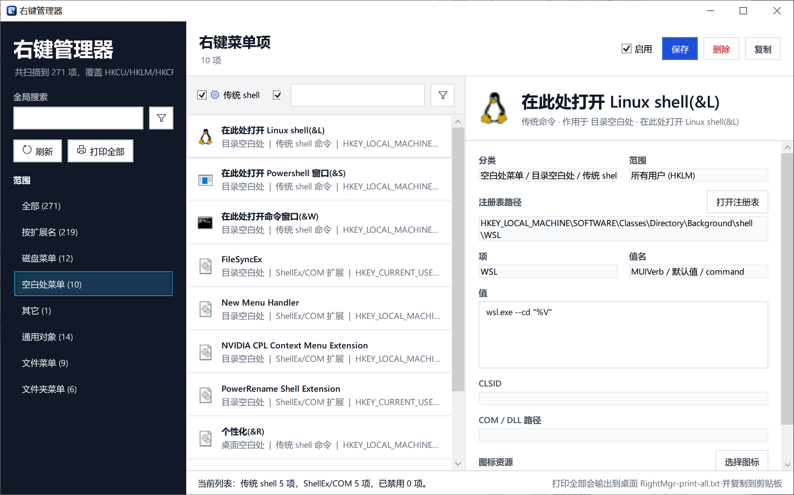

# RightMgr / 右键管理器

RightMgr 是一个用于查看和管理 Windows 右键菜单项的桌面工具。项目基于 .NET 8、WPF 和 Windows App SDK 构建，目标平台为 Windows 10 1809 及以上版本。

## 运行截图



## 功能

- 扫描 Windows 资源管理器右键菜单相关注册表项。
- 展示菜单项名称、命令、注册表路径、CLSID 等详细信息。
- 将 CLSID、`@shell32.dll,-xxxx` 等资源字符串解析为更易读的真实名称。
- 尝试读取 CLSID 的 `DefaultIcon` / `InprocServer32`，并在列表和详情区域显示图标。
- 支持启用、禁用或恢复部分右键菜单项。
- 左侧列表区域支持拖拽调整宽度。
- 右侧详情文本可选择复制，并提供“复制全部”。

## 环境要求

- Windows 10 1809 或更高版本。
- .NET 8 SDK。
- Visual Studio 2022，建议安装：
  - .NET 桌面开发工作负载
  - Windows App SDK / Windows 应用 SDK 相关组件

项目目标框架为：

```text
net8.0-windows10.0.19041.0
```

最低目标平台版本为：

```text
10.0.17763.0
```

## 本地编译

在项目根目录执行：

```powershell
dotnet restore .\RightMgr.csproj
dotnet build .\RightMgr.csproj -c Release -p:Platform=x64 -p:PlatformTarget=x64
```

Debug 编译：

```powershell
dotnet build .\RightMgr.csproj -c Debug -p:Platform=x64 -p:PlatformTarget=x64
```

如果需要清理后重新编译：

```powershell
dotnet clean .\RightMgr.csproj
Remove-Item -Recurse -Force .\bin, .\obj -ErrorAction SilentlyContinue
dotnet restore .\RightMgr.csproj
dotnet build .\RightMgr.csproj -c Release -p:Platform=x64 -p:PlatformTarget=x64
```

## 本地发布

项目已经包含以下发布配置：

| 配置文件 | 平台 | Runtime Identifier | 说明 |
| --- | --- | --- | --- |
| `Properties\PublishProfiles\win-x86.pubxml` | x86 | `win-x86` | x86 自包含发布 |
| `Properties\PublishProfiles\win-x64.pubxml` | x64 | `win-x64` | x64 自包含发布 |
| `Properties\PublishProfiles\win-arm64.pubxml` | ARM64 | `win-arm64` | ARM64 自包含发布 |
| `Properties\PublishProfiles\win-x64-single.pubxml` | x64 | `win-x64` | x64 框架依赖单文件发布 |

发布 x64 自包含版本：

```powershell
dotnet publish .\RightMgr.csproj -c Release -p:PublishProfile=win-x64
```

发布 x86 自包含版本：

```powershell
dotnet publish .\RightMgr.csproj -c Release -p:PublishProfile=win-x86
```

发布 ARM64 自包含版本：

```powershell
dotnet publish .\RightMgr.csproj -c Release -p:PublishProfile=win-arm64
```

发布 x64 单文件版本：

```powershell
dotnet publish .\RightMgr.csproj -c Release -p:PublishProfile=win-x64-single
```

也可以不依赖发布配置，直接通过命令行指定发布形态。下面示例以 `win-x64` 为例，`-r` 可替换为 `win-x86` 或 `win-arm64`。

| 发布形态 | 是否单文件 | 包含 .NET Runtime | 包含 Windows App Runtime | 目标机器要求 |
| --- | --- | --- | --- | --- |
| 多文件，框架依赖 | 否 | 否 | 否 | 已安装 .NET 8 Desktop Runtime 和 Windows App Runtime |
| 多文件，包含 Windows App Runtime | 否 | 否 | 是 | 已安装 .NET 8 Desktop Runtime |
| 多文件，自包含 | 否 | 是 | 否 | 已安装 Windows App Runtime |
| 多文件，完全自包含 | 否 | 是 | 是 | 无需单独安装 .NET 8 Desktop Runtime / Windows App Runtime |
| 单文件，框架依赖 | 是 | 否 | 否 | 已安装 .NET 8 Desktop Runtime 和 Windows App Runtime |
| 单文件，包含 Windows App Runtime | 是 | 否 | 是 | 已安装 .NET 8 Desktop Runtime |
| 单文件，包含 .NET Runtime | 是 | 是 | 否 | 已安装 Windows App Runtime |
| 单文件，完全自包含 | 是 | 是 | 是 | 无需单独安装 .NET 8 Desktop Runtime / Windows App Runtime |

多文件，框架依赖：

```powershell
dotnet publish .\RightMgr.csproj -c Release -r win-x64 --self-contained false -p:PublishSingleFile=false -p:WindowsAppSDKSelfContained=false
```

多文件，包含 Windows App Runtime：

```powershell
dotnet publish .\RightMgr.csproj -c Release -r win-x64 --self-contained false -p:PublishSingleFile=false -p:WindowsAppSDKSelfContained=true
```

多文件，包含 .NET Runtime：

```powershell
dotnet publish .\RightMgr.csproj -c Release -r win-x64 --self-contained true -p:PublishSingleFile=false -p:WindowsAppSDKSelfContained=false
```

多文件，完全自包含：

```powershell
dotnet publish .\RightMgr.csproj -c Release -r win-x64 --self-contained true -p:PublishSingleFile=false -p:WindowsAppSDKSelfContained=true
```

单文件，框架依赖：

```powershell
dotnet publish .\RightMgr.csproj -c Release -r win-x64 --self-contained false -p:PublishSingleFile=true -p:WindowsAppSDKSelfContained=false -p:IncludeNativeLibrariesForSelfExtract=true -p:IncludeAllContentForSelfExtract=true
```

单文件，包含 Windows App Runtime：

```powershell
dotnet publish .\RightMgr.csproj -c Release -r win-x64 --self-contained false -p:PublishSingleFile=true -p:WindowsAppSDKSelfContained=true -p:IncludeNativeLibrariesForSelfExtract=true -p:IncludeAllContentForSelfExtract=true
```

单文件，包含 .NET Runtime：

```powershell
dotnet publish .\RightMgr.csproj -c Release -r win-x64 --self-contained true -p:PublishSingleFile=true -p:WindowsAppSDKSelfContained=false -p:IncludeNativeLibrariesForSelfExtract=true -p:IncludeAllContentForSelfExtract=true
```

单文件，完全自包含：

```powershell
dotnet publish .\RightMgr.csproj -c Release -r win-x64 --self-contained true -p:PublishSingleFile=true -p:WindowsAppSDKSelfContained=true -p:IncludeNativeLibrariesForSelfExtract=true -p:IncludeAllContentForSelfExtract=true
```

发布产物默认输出到：

```text
bin\Release\net8.0-windows10.0.19041.0\<runtime>\publish\
```

x64 单文件发布产物默认输出到：

```text
bin\Release\net8.0-windows10.0.19041.0\win-x64\single\
```

x64 单文件版本需要目标机器已安装 .NET 8 Desktop Runtime 和 Windows App Runtime。

## 运行

编译或发布完成后，运行输出目录中的：

```text
RightMgr.exe
```

部分右键菜单项修改需要管理员权限。建议以管理员身份运行程序，以确保注册表写入操作可以正常完成。

## 项目结构

```text
.
├── Assets/                     应用图标和 MSIX 资源
├── Properties/PublishProfiles/ 发布配置
├── Resources/                  本地化资源
├── src/
│   ├── Models/                 数据模型
│   ├── Services/               注册表扫描、编辑、图标和本地化服务
│   └── Views/                  主窗口界面
├── App.xaml
├── Program.cs
├── RightMgr.csproj
└── RightMgr.slnx
```
